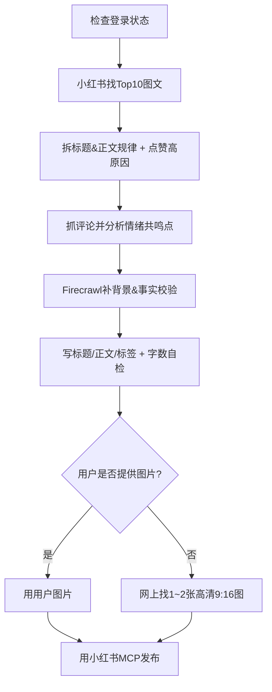

# Write Xiaohongshu（小红书：先研究再写再发）

## Quick Start（最短用法）

当用户给你一个主题时，直接按“步骤 0→6”跑完整流程；最终只输出：

- 标题（≤20 字符）
- 正文（≤1000 字符）
- 标签（#xxx #yyy…）
- 配图（如果用户提供则使用提供图片，没有则自选1~2 张，9:16 优先）
- 用户review后发布
- 发布结果（若小红书 MCP 可用）

## 硬性限制（必须遵守）

- 标题：**≤ 20 字符**
- 正文：**≤ 1000 字符**

计数口径：按“字符”计数（包含空格、标点、换行、#话题 等）。为稳妥：标题尽量≤18，正文尽量≤950，留给标签/格式余量。

## 输出（必须包含这些块）

本 skill 的输出分三段段：

1) **分析总结报告**（在完成步骤 1+2 的分析后必须先给出，结构见下方模板）  
2) **最终可发布成稿**（标题+正文+标签+配图）
3) **review后的发布结果**

```text
标题：<不超过20字符>
正文：
<不超过1000字符>
标签：#标签1 #标签2 #标签3 ...
配图：<1~2张，9:16优先；给出图片URL或本地路径>
```

> 如果发布接口支持“标签单独字段”，则正文里不要堆 #标签，把标签放到发布参数里；最终仍需保证正文自身≤1000。

## 总流程（必须按顺序做）



## 步骤 0：先检查登录状态

先调用小红书mcp检查登录态，未登录要获取二维码给用户登录。

## 步骤 1：小红书找相关“点赞Top10”图文帖，并总结规律

**目标**：先找“同类内容里最受欢迎的写法”，再动笔。

### 硬性门槛（必须执行）

- **必须成功获取到至少 10 条“帖子详情完整可用”的图文帖子**，才能进入步骤 2/3/4/5/6。

要求：

- 只选**图文帖**（排除视频/直播切片）
- 相关性优先，其次点赞数高，筛选“最多点赞”
- 筛选时间“半年内”
- 只使用小红书mcp的get_specified_post工具获取，筛选“图文”，“半年内”的帖子，获取20条帖子数据（实际可能结果少于20条，容错10条）,不准调用mcp的其他工具，该工具返回内容包含所有需要的信息。

对每条 Top 帖子记录这些字段（用于后续分析）：

- 标题（原文）
- 点赞/收藏/评论（若可得）
- 正文结构（用 1 行概括：例如“结论→清单→步骤→反馈→互动”）
- 关键钩子（开头第一句的“吸引点”）
- 证据类型（体验、对比、数据、截图、前后变化…）
- 互动设计（提问、投票、评论关键词、抽奖、合集引导…）

输出一个“规律总结”（写作可直接复用）：

- 标题规律（长度、句式、关键词、符号/数字、情绪词、利益点）
- 正文规律（段落节奏、清单/步骤、转折、避坑、结尾 CTA、口吻风格）
- 点赞高的原因（至少 3 条，尽量落地到“写法/信息密度/共鸣点/可执行性/口吻风格”）

## 步骤 2：根据第一步数据中的评论，分析“情感共鸣”原因

**目标**：找出观众为什么会“想留言/想转发/想收藏”，总结出3-6个共鸣点结论，1个互动设计建议。

做法：

- 归类评论里的“共鸣触发点”，例如：
  - 共同痛点（我也是…）
  - 身份认同（打工人/学生党/宝妈…）
  - 焦虑与解决（终于有办法/被拯救）
  - 价值观（自律、松弛感、性价比、极简…）
  - 反差/意外（原来这样也行）
  - 可复制性（我也能照做）
  - 分享欲（我也想试试）
  - 好奇心（这是什么？）
  - 共鸣点（我也这样）

输出：

- 3～6 个“共鸣点结论”（每个结论配 1～2 条原话片段/概括）

## 分析总结报告（必须输出，然后自动继续后续流程）

当你完成步骤 1+2（且满足“可用样本>=10”）后，**必须先按下面结构输出一份总结报告**（内容风格/颗粒度参考用户给的示例），然后在同一轮输出里**自动继续步骤 3→6**。

如果没满足样本门槛：按步骤 1 的硬性门槛要求**直接停止**，不要进入步骤 2/3/4/5/6，也不要编造报告。

报告模板：

```text
【分析总结报告】
评论数/互动量排名（从高到低）
1. <标题> - <评论数>（<图文/视频>）
2. ...
...
10. ...
11. ...

标题规律分析
- <规律1>
- <规律2>
- <规律3>
...

内容规律分析
- <规律1>
- <规律2>
...

封面规律分析
- <规律1>
- <规律2>
...

总结
爆款三要素：
1. <要素1>
2. <要素2>
3. <要素3>

互动催化剂：
- <催化剂1>
- <催化剂2>
...
```
## 步骤 3：用 Firecrawl MCP 补全背景知识（并做事实校验）

**目标**：避免内容空、避免错误/夸大，补齐“可信信息”。

做法：

- 用主题关键词扩展检索：概念解释、常见误区、权威建议、数据（尽量来自可信来源）
- 提炼为“可引用的 5～10 条背景要点”（短句即可）
- 对容易被质疑的说法（疗效、收益、对比结论）做降级处理：
  - 改成“我个人体验/适合一部分人/可能有效”
  - 或加条件（适用人群、前提）

输出一个“背景知识卡片”：

- 关键结论（5～10 条）
- 风险/注意事项（2～4 条）

## 步骤 4：基于以上分析写标题+正文+标签（并强制字数自检）

写作要求（偏小红书、但别装）：

- 口语化、句子短、1–3 句换行
- 信息密度要高：少空话，多“可照做的步骤/清单”
- 可适当使用 emoji（提升节奏/情绪），但不要堆
- 结尾要自然，像真实用户写的，不要“营销号口吻”

### 去 AI 味提示词（必须执行）

- **多写“我/我当时/我发现/我踩过的坑”**，少用“大家/用户/受众/建议如下”
- **给 2～3 个具体细节**：时间点、场景、对比前后、具体一句台词/一个镜头/一个小动作
- **允许不完美**：用“我感觉/我猜/可能/不确定但…”（别装权威）
- **少模板话**：避免“总的来说/综上/因此/首先其次最后/不容错过/速速”
- **像在跟朋友聊天**：短句、断行、偶尔口头词（但别堆）

**字数闸口（必须最后做）**：

- 标题字符数 > 20：删冗余词、去副标题、改短句、去掉不必要符号
- 正文字符数 > 1000：先删重复与口头禅，再合并句子，再压缩步骤/减少案例
- 最终只输出合规版本

## 步骤 5：若用户没给图，自己上网找 1～2 张高清图（9:16 优先）

要求：

- 1～2 张即可，高清、干净、与主题强相关
- 比例优先 9:16（竖图）
- 只选**可商用/免版权风险**来源优先（例如 Pexels / Unsplash 等）
- 输出时给出：图片 URL（以及可选：本地下载路径）

## 步骤 6：用小红书 MCP 发布

发布时（按 MCP 能力适配，能做到多少做多少）：

- 上传 1～2 张图片（竖图优先）
- 设置标题、正文、标签
- 若支持：先创建草稿 → 回显草稿信息 → 再发布

发布成功后输出：

- 已发布链接/ID（若可得）
- 发布参数摘要（标题/标签/图片数）

## 兜底策略（工具不可用时）

如果当前环境没有 Firecrawl MCP 或小红书 MCP：

- 仍按流程完成“分析→写作→配图链接”，但不做自动发布
- 把需要用户补充的信息列成最短清单（例如：给 3~5 个对标帖子链接，或授权/接口配置）

## Examples（示例）

### 示例 1：用户只给主题

用户输入：

> 写一篇小红书图文：主题是“上班族快速晚餐”，适合一个人，预算 20 元以内。

你要做：

- 用主题关键词在小红书找“图文帖”，总结标题/正文规律
- 抓这些帖子的评论，提炼共鸣点与互动问题
- 用 Firecrawl 补充“健康/备餐/安全”相关背景
- 输出标题+正文+标签，并做字数自检
- 没有图片就去找 1~2 张高清 9:16 竖图
- 用小红书 MCP 发布（若可用）

### 示例 2：用户提供图片

用户输入：

> 我有5张竖图（9:16），帮我写一篇小红书，主题是“新手化妆避坑”，偏温柔口吻。

你要做：

- 仍然先做 Top10+评论+背景三步分析
- 写完文案后直接用用户提供的图片发布

